# SES管理アプリ データベース設計書

## 概要

本文書は、SES管理アプリケーションのデータベース設計を示すものです。加盟店（テナント）、営業、クライアント、エンジニア、案件、契約管理などの機能を網羅したテーブル構成となっています。

## ER図

```mermaid
erDiagram
    TENANTS {
        bigint id PK
        string name "加盟店名"
        string email "メールアドレス"
        enum status "ステータス(審査中/利用中/凍結)"
        date service_start_date "利用開始日"
        timestamp last_login_at "最終ログイン"
        timestamp last_data_registered_at "最終データ登録"
        timestamp created_at
        timestamp updated_at
    }

    SALES_TEAMS {
        bigint id PK
        bigint tenant_id FK
        string name "営業チーム名"
        timestamp created_at
        timestamp updated_at
    }

    SALES {
        bigint id PK
        bigint tenant_id FK
        bigint sales_team_id FK
        string name "営業担当者名"
        string email "メールアドレス"
        string avatar_url "アバター画像URL"
        enum status "ステータス(仮登録/招待中/本登録/退会)"
        timestamp created_at
        timestamp updated_at
    }

    CLIENTS {
        bigint id PK
        bigint tenant_id FK
        bigint sales_id FK "担当営業"
        bigint industry_id FK "業界"
        string company_name "企業名"
        text description "企業概要"
        text sales_memo "営業メモ"
        enum status "ステータス(取引中/休止中/終了)"
        timestamp created_at
        timestamp updated_at
    }

    INDUSTRIES {
        bigint id PK
        string name "業界名"
        timestamp created_at
        timestamp updated_at
    }

    PROJECTS {
        bigint id PK
        bigint client_id FK
        bigint tenant_id FK
        string name "案件名"
        text description "案件詳細"
        enum status "ステータス(募集中/進行中/完了/中断)"
        integer budget_min "単価下限"
        integer budget_max "単価上限"
        string duration "期間"
        string work_style "勤務形態"
        string location "勤務地"
        date start_date "稼働開始日"
        date end_date "稼働終了予定日"
        timestamp created_at
        timestamp updated_at
    }

    SKILLS {
        bigint id PK
        string name "スキル名"
        enum category "カテゴリ(プログラミング言語/フレームワーク/データベース/ツール/ドメイン知識/工程・ポジション)"
        timestamp created_at
        timestamp updated_at
    }

    CLIENT_REQUIRED_SKILLS {
        bigint id PK
        bigint client_id FK
        bigint skill_id FK
        integer experience_years "必要経験年数"
        timestamp created_at
        timestamp updated_at
    }

    PROJECT_REQUIRED_SKILLS {
        bigint id PK
        bigint project_id FK
        bigint skill_id FK
        integer experience_years "必要経験年数"
        timestamp created_at
        timestamp updated_at
    }

    ENGINEERS {
        bigint id PK
        bigint tenant_id FK
        string name "氏名"
        string email "メールアドレス"
        string phone "電話番号"
        string avatar_url "アバター画像URL"
        integer experience_years "経験年数"
        integer monthly_rate "希望単価(万円)"
        string work_style "希望勤務形態"
        date available_from "稼働開始可能日"
        string resume_file_path "職務経歴書ファイルパス"
        string skill_sheet_file_path "スキルシートファイルパス"
        timestamp created_at
        timestamp updated_at
    }

    ENGINEER_SKILLS {
        bigint id PK
        bigint engineer_id FK
        bigint skill_id FK
        integer experience_years "経験年数"
        timestamp created_at
        timestamp updated_at
    }

    PROJECT_ASSIGNMENTS {
        bigint id PK
        bigint project_id FK
        bigint engineer_id FK
        enum status "ステータス(候補/選考中/アサイン確定/見送り)"
        timestamp created_at
        timestamp updated_at
    }

    CONTRACTS {
        bigint id PK
        bigint tenant_id FK
        bigint client_id FK
        bigint project_id FK
        bigint engineer_id FK
        bigint sales_id FK "営業担当者"
        string contract_id "契約ID"
        enum status "ステータス(契約中/更新予定/期間満了/解約)"
        date start_date "開始日"
        date end_date "終了日"
        enum contract_type "契約形態"
        enum closing_day "締め日(15日/20日/月末)"
        integer payment_month_offset "支払月オフセット(1=翌月、2=翌々月)"
        enum payment_day "支払日(15日/20日/月末)"
        string work_style "勤務形態"
        string work_location "作業場所"
        string work_hours "稼働時間"
        integer work_days_per_week "稼働日数"
        integer monthly_rate "単価(円/月)"
        integer overtime_rate "原価(円/月)"
        integer min_working_hours_per_month "最低稼働時間(h/月)"
        integer max_working_hours_per_month "最大稼働時間(h/月)"
        string overtime_rules "超過/控除ルール"
        integer contract_fee "契約工数(h/月)"
        string contract_file_path "契約書ファイルパス"
        text notes "備考・メモ"
        date last_updated_date "更新予定日"
        enum renewal_status "確認状況"
        string renewal_notes "更新条件"
        timestamp created_at
        timestamp updated_at
    }

    CLIENT_CONTACTS {
        bigint id PK
        bigint client_id FK
        string name "担当者名"
        string department "部署"
        string email "メールアドレス"
        string phone "電話番号"
        boolean is_primary "主担当フラグ"
        timestamp created_at
        timestamp updated_at
    }

    CLIENT_PREFERRED_ENGINEERS {
        bigint id PK
        bigint client_id FK
        bigint engineer_id FK
        timestamp created_at
        timestamp updated_at
    }

    SALES_TARGETS {
        bigint id PK
        bigint tenant_id FK
        bigint sales_team_id FK
        enum target_period "目標期間(月次/四半期/年次)"
        date period_start "期間開始日"
        date period_end "期間終了日"
        integer target_amount "目標金額(万円)"
        integer profit_target_amount "利益目標金額(万円)"
        integer average_project_price "平均案件単価(万円)"
        decimal expected_contract_rate "期待成約率(%)"
        enum status "ステータス(設定中/有効/完了)"
        timestamp created_at
        timestamp updated_at
    }

    INDIVIDUAL_SALES_TARGETS {
        bigint id PK
        bigint sales_target_id FK
        bigint sales_id FK
        integer target_amount "個人目標金額(万円)"
        timestamp created_at
        timestamp updated_at
    }

    SALES_RESULTS {
        bigint id PK
        bigint tenant_id FK
        bigint sales_team_id FK
        bigint sales_id FK
        date recorded_date "計上年月日"
        integer sales_amount "売上金額"
        integer cost_amount "原価金額"
        integer profit_amount "利益金額(売上-原価)"
        timestamp created_at
        timestamp updated_at
    }

    ENGINEER_ASSIGNMENTS {
        bigint id PK
        bigint engineer_id FK
        bigint sales_id FK "エンジニア担当営業"
        timestamp created_at
        timestamp updated_at
    }

    PROJECT_SALES_ASSIGNMENTS {
        bigint id PK
        bigint project_id FK
        bigint sales_id FK "案件担当営業"
        timestamp created_at
        timestamp updated_at
    }

    CLIENT_SALES_ASSIGNMENTS {
        bigint id PK
        bigint client_id FK
        bigint sales_id FK "企業担当営業"
        text memo "営業メモ"
        timestamp created_at
        timestamp updated_at
    }

    NOTIFICATIONS {
        bigint id PK
        bigint tenant_id FK
        bigint contract_id FK
        enum notification_type "通知タイプ(契約更新/契約終了/売上実績/その他)"
        string title "通知タイトル"
        text description "通知内容"
        enum priority "優先度(高/中/低)"
        enum status "ステータス(未着手/進行中/完了)"
        date due_date "期限日(期限までの日数はフロントで算出)"
        boolean is_read "既読フラグ"
        timestamp created_at
        timestamp updated_at
    }

    ACTION_ITEMS {
        bigint id PK
        bigint notification_id FK
        bigint contract_id FK
        bigint assigned_sales_id FK "担当営業"
        string title "アクションアイテム名"
        text description "アクション詳細"
        date due_date "期限日"
        enum status "ステータス(未完了/完了)"
        boolean is_completed "完了フラグ"
        timestamp completed_at "完了日時"
        timestamp created_at
        timestamp updated_at
    }

    TENANTS ||--o{ SALES_TEAMS : "has many"
    TENANTS ||--o{ SALES : "has many"
    TENANTS ||--o{ CLIENTS : "has many"
    TENANTS ||--o{ PROJECTS : "has many"
    TENANTS ||--o{ ENGINEERS : "has many"
    TENANTS ||--o{ CONTRACTS : "has many"
    TENANTS ||--o{ SALES_TARGETS : "has many"
    TENANTS ||--o{ SALES_RESULTS : "has many"
    TENANTS ||--o{ NOTIFICATIONS : "has many"
    SALES_TEAMS ||--o{ SALES : "has many"
    SALES_TEAMS ||--o{ SALES_TARGETS : "has many"
    SALES_TEAMS ||--o{ SALES_RESULTS : "has many"
    SALES ||--o{ CLIENTS : "担当"
    SALES ||--o{ CONTRACTS : "担当"
    SALES ||--o{ INDIVIDUAL_SALES_TARGETS : "has many"
    SALES ||--o{ SALES_RESULTS : "has many"
    SALES ||--o{ ENGINEER_ASSIGNMENTS : "has many"
    SALES ||--o{ PROJECT_SALES_ASSIGNMENTS : "has many"
    SALES ||--o{ CLIENT_SALES_ASSIGNMENTS : "has many"
    SALES ||--o{ ACTION_ITEMS : "担当"
    SALES_TARGETS ||--o{ INDIVIDUAL_SALES_TARGETS : "has many"
    INDUSTRIES ||--o{ CLIENTS : "has many"
    CLIENTS ||--o{ PROJECTS : "has many"
    CLIENTS ||--o{ CLIENT_REQUIRED_SKILLS : "has many"
    CLIENTS ||--o{ CLIENT_PREFERRED_ENGINEERS : "has many"
    CLIENTS ||--o{ CLIENT_CONTACTS : "has many"
    CLIENTS ||--o{ CONTRACTS : "has many"
    CLIENTS ||--o{ CLIENT_SALES_ASSIGNMENTS : "has many"
    PROJECTS ||--o{ PROJECT_REQUIRED_SKILLS : "has many"
    PROJECTS ||--o{ PROJECT_ASSIGNMENTS : "has many"
    PROJECTS ||--o{ CONTRACTS : "has many"
    PROJECTS ||--o{ PROJECT_SALES_ASSIGNMENTS : "has many"
    ENGINEERS ||--o{ ENGINEER_SKILLS : "has many"
    ENGINEERS ||--o{ PROJECT_ASSIGNMENTS : "has many"
    ENGINEERS ||--o{ CLIENT_PREFERRED_ENGINEERS : "has many"
    ENGINEERS ||--o{ CONTRACTS : "has many"
    ENGINEERS ||--o{ ENGINEER_ASSIGNMENTS : "has many"
    CONTRACTS ||--o{ NOTIFICATIONS : "has many"
    CONTRACTS ||--o{ ACTION_ITEMS : "has many"
    NOTIFICATIONS ||--o{ ACTION_ITEMS : "has many"
    CLIENT_CONTACTS ||--o{ CONTRACTS : "担当者として"
    SKILLS ||--o{ CLIENT_REQUIRED_SKILLS : "has many"
    SKILLS ||--o{ PROJECT_REQUIRED_SKILLS : "has many"
    SKILLS ||--o{ ENGINEER_SKILLS : "has many"
```

## テーブル一覧

### 1. TENANTS（加盟店）

本アプリを使用する企業の管理テーブル

| カラム名                | データ型  | 制約     | 説明                           |
| ----------------------- | --------- | -------- | ------------------------------ |
| id                      | bigint    | PK       | 加盟店ID                       |
| name                    | string    | NOT NULL | 加盟店名                       |
| email                   | string    | NOT NULL | メールアドレス                 |
| status                  | enum      | NOT NULL | ステータス(審査中/利用中/凍結) |
| service_start_date      | date      |          | 利用開始日                     |
| last_login_at           | timestamp |          | 最終ログイン                   |
| last_data_registered_at | timestamp |          | 最終データ登録                 |
| created_at              | timestamp | NOT NULL | 作成日時                       |
| updated_at              | timestamp | NOT NULL | 更新日時                       |

### 2. SALES_TEAMS（営業チーム）

各加盟店内の営業チーム管理テーブル

| カラム名   | データ型  | 制約         | 説明         |
| ---------- | --------- | ------------ | ------------ |
| id         | bigint    | PK           | 営業チームID |
| tenant_id  | bigint    | FK, NOT NULL | 加盟店ID     |
| name       | string    | NOT NULL     | 営業チーム名 |
| created_at | timestamp | NOT NULL     | 作成日時     |
| updated_at | timestamp | NOT NULL     | 更新日時     |

### 3. SALES（営業担当者）

営業担当者の情報管理テーブル

| カラム名      | データ型  | 制約         | 説明                                  |
| ------------- | --------- | ------------ | ------------------------------------- |
| id            | bigint    | PK           | 営業担当者ID                          |
| tenant_id     | bigint    | FK, NOT NULL | 加盟店ID                              |
| sales_team_id | bigint    | FK, NOT NULL | 営業チームID                          |
| name          | string    | NOT NULL     | 営業担当者名                          |
| email         | string    | NOT NULL     | メールアドレス                        |
| avatar_url    | string    |              | アバター画像URL                       |
| status        | enum      | NOT NULL     | ステータス(仮登録/招待中/本登録/退会) |
| created_at    | timestamp | NOT NULL     | 作成日時                              |
| updated_at    | timestamp | NOT NULL     | 更新日時                              |

### 4. INDUSTRIES（業界）

業界マスタテーブル

| カラム名   | データ型  | 制約     | 説明     |
| ---------- | --------- | -------- | -------- |
| id         | bigint    | PK       | 業界ID   |
| name       | string    | NOT NULL | 業界名   |
| created_at | timestamp | NOT NULL | 作成日時 |
| updated_at | timestamp | NOT NULL | 更新日時 |

### 5. CLIENTS（クライアント）

各加盟店の顧客企業情報管理テーブル

| カラム名     | データ型  | 制約         | 説明                           |
| ------------ | --------- | ------------ | ------------------------------ |
| id           | bigint    | PK           | クライアントID                 |
| tenant_id    | bigint    | FK, NOT NULL | 加盟店ID                       |
| sales_id     | bigint    | FK, NOT NULL | 担当営業ID                     |
| industry_id  | bigint    | FK, NOT NULL | 業界ID                         |
| company_name | string    | NOT NULL     | 企業名                         |
| description  | text      |              | 企業概要                       |
| sales_memo   | text      |              | 営業メモ                       |
| status       | enum      | NOT NULL     | ステータス(取引中/休止中/終了) |
| created_at   | timestamp | NOT NULL     | 作成日時                       |
| updated_at   | timestamp | NOT NULL     | 更新日時                       |

### 6. CLIENT_CONTACTS（クライアント担当者）

クライアント側の担当者情報管理テーブル

| カラム名   | データ型  | 制約         | 説明           |
| ---------- | --------- | ------------ | -------------- |
| id         | bigint    | PK           | 担当者ID       |
| client_id  | bigint    | FK, NOT NULL | クライアントID |
| name       | string    | NOT NULL     | 担当者名       |
| department | string    |              | 部署           |
| email      | string    |              | メールアドレス |
| phone      | string    |              | 電話番号       |
| is_primary | boolean   | NOT NULL     | 主担当フラグ   |
| created_at | timestamp | NOT NULL     | 作成日時       |
| updated_at | timestamp | NOT NULL     | 更新日時       |

### 7. PROJECTS（案件）

開発案件の情報管理テーブル

| カラム名    | データ型  | 制約         | 説明                                |
| ----------- | --------- | ------------ | ----------------------------------- |
| id          | bigint    | PK           | 案件ID                              |
| client_id   | bigint    | FK, NOT NULL | クライアントID                      |
| tenant_id   | bigint    | FK, NOT NULL | 加盟店ID                            |
| name        | string    | NOT NULL     | 案件名                              |
| description | text      |              | 案件詳細                            |
| status      | enum      | NOT NULL     | ステータス(募集中/進行中/完了/中断) |
| budget_min  | integer   |              | 単価下限                            |
| budget_max  | integer   |              | 単価上限                            |
| duration    | string    |              | 期間                                |
| work_style  | string    |              | 勤務形態                            |
| location    | string    |              | 勤務地                              |
| start_date  | date      |              | 稼働開始日                          |
| end_date    | date      |              | 稼働終了予定日                      |
| created_at  | timestamp | NOT NULL     | 作成日時                            |
| updated_at  | timestamp | NOT NULL     | 更新日時                            |

### 8. SKILLS（スキル）

プログラミング言語、フレームワーク、工程・ポジションなどのスキルマスタテーブル

| カラム名   | データ型  | 制約     | 説明                                                                                          |
| ---------- | --------- | -------- | --------------------------------------------------------------------------------------------- |
| id         | bigint    | PK       | スキルID                                                                                      |
| name       | string    | NOT NULL | スキル名                                                                                      |
| category   | enum      | NOT NULL | カテゴリ(プログラミング言語/フレームワーク/データベース/ツール/ドメイン知識/工程・ポジション) |
| created_at | timestamp | NOT NULL | 作成日時                                                                                      |
| updated_at | timestamp | NOT NULL | 更新日時                                                                                      |

### 9. CLIENT_REQUIRED_SKILLS（クライアント要求スキル）

クライアントが求めるスキル要件管理テーブル

| カラム名         | データ型  | 制約         | 説明           |
| ---------------- | --------- | ------------ | -------------- |
| id               | bigint    | PK           | ID             |
| client_id        | bigint    | FK, NOT NULL | クライアントID |
| skill_id         | bigint    | FK, NOT NULL | スキルID       |
| experience_years | integer   |              | 必要経験年数   |
| created_at       | timestamp | NOT NULL     | 作成日時       |
| updated_at       | timestamp | NOT NULL     | 更新日時       |

### 10. PROJECT_REQUIRED_SKILLS（案件要求スキル）

個別案件に対するスキル要件管理テーブル

| カラム名         | データ型  | 制約         | 説明         |
| ---------------- | --------- | ------------ | ------------ |
| id               | bigint    | PK           | ID           |
| project_id       | bigint    | FK, NOT NULL | 案件ID       |
| skill_id         | bigint    | FK, NOT NULL | スキルID     |
| experience_years | integer   |              | 必要経験年数 |
| created_at       | timestamp | NOT NULL     | 作成日時     |
| updated_at       | timestamp | NOT NULL     | 更新日時     |

### 11. ENGINEERS（エンジニア）

エンジニア情報管理テーブル

| カラム名              | データ型  | 制約         | 説明                     |
| --------------------- | --------- | ------------ | ------------------------ |
| id                    | bigint    | PK           | エンジニアID             |
| tenant_id             | bigint    | FK, NOT NULL | 加盟店ID                 |
| name                  | string    | NOT NULL     | 氏名                     |
| email                 | string    | NOT NULL     | メールアドレス           |
| phone                 | string    |              | 電話番号                 |
| avatar_url            | string    |              | アバター画像URL          |
| experience_years      | integer   |              | 経験年数                 |
| monthly_rate          | integer   |              | 希望単価(万円)           |
| work_style            | string    |              | 希望勤務形態             |
| available_from        | date      |              | 稼働開始可能日           |
| resume_file_path      | string    |              | 職務経歴書ファイルパス   |
| skill_sheet_file_path | string    |              | スキルシートファイルパス |
| created_at            | timestamp | NOT NULL     | 作成日時                 |
| updated_at            | timestamp | NOT NULL     | 更新日時                 |

### 12. ENGINEER_SKILLS（エンジニアスキル）

エンジニアが持つスキルと経験年数の紐づけテーブル

| カラム名         | データ型  | 制約         | 説明         |
| ---------------- | --------- | ------------ | ------------ |
| id               | bigint    | PK           | ID           |
| engineer_id      | bigint    | FK, NOT NULL | エンジニアID |
| skill_id         | bigint    | FK, NOT NULL | スキルID     |
| experience_years | integer   |              | 経験年数     |
| created_at       | timestamp | NOT NULL     | 作成日時     |
| updated_at       | timestamp | NOT NULL     | 更新日時     |

### 13. PROJECT_ASSIGNMENTS（案件アサイン）

エンジニアの案件への候補・アサイン状況管理テーブル

| カラム名    | データ型  | 制約         | 説明                                        |
| ----------- | --------- | ------------ | ------------------------------------------- |
| id          | bigint    | PK           | ID                                          |
| project_id  | bigint    | FK, NOT NULL | 案件ID                                      |
| engineer_id | bigint    | FK, NOT NULL | エンジニアID                                |
| status      | enum      | NOT NULL     | ステータス(候補/選考中/アサイン確定/見送り) |
| created_at  | timestamp | NOT NULL     | 作成日時                                    |
| updated_at  | timestamp | NOT NULL     | 更新日時                                    |

### 14. CLIENT_PREFERRED_ENGINEERS（クライアント好評エンジニア）

クライアント登録時の「好評だったエンジニア」選択管理テーブル

| カラム名    | データ型  | 制約         | 説明           |
| ----------- | --------- | ------------ | -------------- |
| id          | bigint    | PK           | ID             |
| client_id   | bigint    | FK, NOT NULL | クライアントID |
| engineer_id | bigint    | FK, NOT NULL | エンジニアID   |
| created_at  | timestamp | NOT NULL     | 作成日時       |
| updated_at  | timestamp | NOT NULL     | 更新日時       |

### 15. CONTRACTS（契約）

正式な契約管理テーブル

| カラム名                    | データ型  | 制約         | 説明                                      |
| --------------------------- | --------- | ------------ | ----------------------------------------- |
| id                          | bigint    | PK           | 契約ID                                    |
| tenant_id                   | bigint    | FK, NOT NULL | 加盟店ID                                  |
| client_id                   | bigint    | FK, NOT NULL | クライアントID                            |
| project_id                  | bigint    | FK, NOT NULL | 案件ID                                    |
| engineer_id                 | bigint    | FK, NOT NULL | エンジニアID                              |
| sales_id                    | bigint    | FK, NOT NULL | 営業担当者ID                              |
| contract_id                 | string    |              | 契約ID                                    |
| status                      | enum      | NOT NULL     | ステータス(契約中/更新予定/期間満了/解約) |
| start_date                  | date      |              | 開始日                                    |
| end_date                    | date      |              | 終了日                                    |
| contract_type               | enum      |              | 契約形態                                  |
| closing_day                 | enum      |              | 締め日(15日/20日/月末)                    |
| payment_month_offset        | integer   |              | 支払月オフセット(1=翌月、2=翌々月)        |
| payment_day                 | enum      |              | 支払日(15日/20日/月末)                    |
| work_style                  | string    |              | 勤務形態                                  |
| work_location               | string    |              | 作業場所                                  |
| work_hours                  | string    |              | 稼働時間                                  |
| work_days_per_week          | integer   |              | 稼働日数                                  |
| monthly_rate                | integer   |              | 単価(円/月)                               |
| overtime_rate               | integer   |              | 原価(円/月)                               |
| min_working_hours_per_month | integer   |              | 最低稼働時間(h/月)                        |
| max_working_hours_per_month | integer   |              | 最大稼働時間(h/月)                        |
| overtime_rules              | string    |              | 超過/控除ルール                           |
| contract_fee                | integer   |              | 契約工数(h/月)                            |
| contract_file_path          | string    |              | 契約書ファイルパス                        |
| notes                       | text      |              | 備考・メモ                                |
| last_updated_date           | date      |              | 更新予定日                                |
| renewal_status              | enum      |              | 確認状況                                  |
| renewal_notes               | string    |              | 更新条件                                  |
| created_at                  | timestamp | NOT NULL     | 作成日時                                  |
| updated_at                  | timestamp | NOT NULL     | 更新日時                                  |

### 16. SALES_TARGETS（売上目標）

チーム全体の売上目標設定テーブル

| カラム名               | データ型  | 制約         | 説明                         |
| ---------------------- | --------- | ------------ | ---------------------------- |
| id                     | bigint    | PK           | 売上目標ID                   |
| tenant_id              | bigint    | FK, NOT NULL | 加盟店ID                     |
| sales_team_id          | bigint    | FK, NOT NULL | 営業チームID                 |
| target_period          | enum      | NOT NULL     | 目標期間(月次/四半期/年次)   |
| period_start           | date      | NOT NULL     | 期間開始日                   |
| period_end             | date      | NOT NULL     | 期間終了日                   |
| target_amount          | integer   | NOT NULL     | 目標金額(万円)               |
| profit_target_amount   | integer   |              | 利益目標金額(万円)           |
| average_project_price  | integer   |              | 平均案件単価(万円)           |
| expected_contract_rate | decimal   |              | 期待成約率(%)                |
| status                 | enum      | NOT NULL     | ステータス(設定中/有効/完了) |
| created_at             | timestamp | NOT NULL     | 作成日時                     |
| updated_at             | timestamp | NOT NULL     | 更新日時                     |

### 17. INDIVIDUAL_SALES_TARGETS（個人売上目標）

営業担当者ごとの個別目標金額管理テーブル

| カラム名        | データ型  | 制約         | 説明               |
| --------------- | --------- | ------------ | ------------------ |
| id              | bigint    | PK           | ID                 |
| sales_target_id | bigint    | FK, NOT NULL | 売上目標ID         |
| sales_id        | bigint    | FK, NOT NULL | 営業担当者ID       |
| target_amount   | integer   | NOT NULL     | 個人目標金額(万円) |
| created_at      | timestamp | NOT NULL     | 作成日時           |
| updated_at      | timestamp | NOT NULL     | 更新日時           |

### 18. SALES_RESULTS（売上実績）

チーム・個人別の売上実績管理テーブル

| カラム名      | データ型  | 制約         | 説明                |
| ------------- | --------- | ------------ | ------------------- |
| id            | bigint    | PK           | 売上実績ID          |
| tenant_id     | bigint    | FK, NOT NULL | 加盟店ID            |
| sales_team_id | bigint    | FK, NOT NULL | 営業チームID        |
| sales_id      | bigint    | FK, NOT NULL | 営業担当者ID        |
| recorded_date | date      | NOT NULL     | 計上年月日          |
| sales_amount  | integer   | NOT NULL     | 売上金額            |
| cost_amount   | integer   | NOT NULL     | 原価金額            |
| profit_amount | integer   | NOT NULL     | 利益金額(売上-原価) |
| created_at    | timestamp | NOT NULL     | 作成日時            |
| updated_at    | timestamp | NOT NULL     | 更新日時            |

### 19. ENGINEER_ASSIGNMENTS（エンジニア担当管理）

エンジニアと営業担当者の紐づけテーブル

| カラム名    | データ型  | 制約         | 説明                 |
| ----------- | --------- | ------------ | -------------------- |
| id          | bigint    | PK           | ID                   |
| engineer_id | bigint    | FK, NOT NULL | エンジニアID         |
| sales_id    | bigint    | FK, NOT NULL | エンジニア担当営業ID |
| created_at  | timestamp | NOT NULL     | 作成日時             |
| updated_at  | timestamp | NOT NULL     | 更新日時             |

### 20. PROJECT_SALES_ASSIGNMENTS（案件担当管理）

案件と営業担当者の紐づけテーブル

| カラム名   | データ型  | 制約         | 説明           |
| ---------- | --------- | ------------ | -------------- |
| id         | bigint    | PK           | ID             |
| project_id | bigint    | FK, NOT NULL | 案件ID         |
| sales_id   | bigint    | FK, NOT NULL | 案件担当営業ID |
| created_at | timestamp | NOT NULL     | 作成日時       |
| updated_at | timestamp | NOT NULL     | 更新日時       |

### 21. CLIENT_SALES_ASSIGNMENTS（企業担当管理）

クライアントと営業担当者の紐づけテーブル

| カラム名   | データ型  | 制約         | 説明           |
| ---------- | --------- | ------------ | -------------- |
| id         | bigint    | PK           | ID             |
| client_id  | bigint    | FK, NOT NULL | クライアントID |
| sales_id   | bigint    | FK, NOT NULL | 企業担当営業ID |
| memo       | text      |              | 営業メモ       |
| created_at | timestamp | NOT NULL     | 作成日時       |
| updated_at | timestamp | NOT NULL     | 更新日時       |

### 22. NOTIFICATIONS（通知）

契約更新、売上実績などの通知管理テーブル

| カラム名          | データ型  | 制約         | 説明                                          |
| ----------------- | --------- | ------------ | --------------------------------------------- |
| id                | bigint    | PK           | 通知ID                                        |
| tenant_id         | bigint    | FK, NOT NULL | 加盟店ID                                      |
| contract_id       | bigint    | FK           | 契約ID                                        |
| notification_type | enum      | NOT NULL     | 通知タイプ(契約更新/契約終了/売上実績/その他) |
| title             | string    | NOT NULL     | 通知タイトル                                  |
| description       | text      |              | 通知内容                                      |
| priority          | enum      | NOT NULL     | 優先度(高/中/低)                              |
| status            | enum      |              | ステータス(未着手/進行中/完了)                |
| due_date          | date      |              | 期限日(期限までの日数はフロントで算出)        |
| is_read           | boolean   | NOT NULL     | 既読フラグ                                    |
| created_at        | timestamp | NOT NULL     | 作成日時                                      |
| updated_at        | timestamp | NOT NULL     | 更新日時                                      |

### 23. ACTION_ITEMS（アクションアイテム）

各通知に対する具体的なタスク管理テーブル

| カラム名          | データ型  | 制約         | 説明                    |
| ----------------- | --------- | ------------ | ----------------------- |
| id                | bigint    | PK           | アクションアイテムID    |
| notification_id   | bigint    | FK, NOT NULL | 通知ID                  |
| contract_id       | bigint    | FK, NOT NULL | 契約ID                  |
| assigned_sales_id | bigint    | FK, NOT NULL | 担当営業ID              |
| title             | string    | NOT NULL     | アクションアイテム名    |
| description       | text      |              | アクション詳細          |
| due_date          | date      |              | 期限日                  |
| status            | enum      | NOT NULL     | ステータス(未完了/完了) |
| is_completed      | boolean   | NOT NULL     | 完了フラグ              |
| completed_at      | timestamp |              | 完了日時                |
| created_at        | timestamp | NOT NULL     | 作成日時                |
| updated_at        | timestamp | NOT NULL     | 更新日時                |

## テーブル間のリレーション

### 主要なリレーション関係

#### 加盟店を中心とした関係

- `TENANTS` 1:N `SALES_TEAMS`（1つの加盟店は複数の営業チームを持つ）
- `TENANTS` 1:N `SALES`（1つの加盟店は複数の営業担当者を持つ）
- `TENANTS` 1:N `CLIENTS`（1つの加盟店は複数のクライアントを持つ）
- `TENANTS` 1:N `PROJECTS`（1つの加盟店は複数の案件を持つ）
- `TENANTS` 1:N `ENGINEERS`（1つの加盟店は複数のエンジニアを持つ）
- `TENANTS` 1:N `CONTRACTS`（1つの加盟店は複数の契約を持つ）

#### 営業関連

- `SALES_TEAMS` 1:N `SALES`（1つの営業チームは複数の営業担当者を持つ）
- `SALES` 1:N `CLIENTS`（1つの営業担当者は複数のクライアントを担当）
- `SALES` 1:N `CONTRACTS`（1つの営業担当者は複数の契約を担当）

#### クライアント・案件関連

- `INDUSTRIES` 1:N `CLIENTS`（1つの業界は複数のクライアントを持つ）
- `CLIENTS` 1:N `PROJECTS`（1つのクライアントは複数の案件を持つ）
- `CLIENTS` 1:N `CLIENT_CONTACTS`（1つのクライアントは複数の担当者を持つ）
- `CLIENTS` 1:N `CONTRACTS`（1つのクライアントは複数の契約を持つ）

#### スキル関連

- `SKILLS` 1:N `CLIENT_REQUIRED_SKILLS`（1つのスキルは複数のクライアント要求に使用）
- `SKILLS` 1:N `PROJECT_REQUIRED_SKILLS`（1つのスキルは複数の案件要求に使用）
- `SKILLS` 1:N `ENGINEER_SKILLS`（1つのスキルは複数のエンジニアが保有）

#### エンジニア関連

- `ENGINEERS` 1:N `ENGINEER_SKILLS`（1つのエンジニアは複数のスキルを持つ）
- `ENGINEERS` 1:N `PROJECT_ASSIGNMENTS`（1つのエンジニアは複数の案件にアサイン）
- `ENGINEERS` 1:N `CONTRACTS`（1つのエンジニアは複数の契約を持つ）

#### 案件・契約関連

- `PROJECTS` 1:N `PROJECT_REQUIRED_SKILLS`（1つの案件は複数のスキル要求を持つ）
- `PROJECTS` 1:N `PROJECT_ASSIGNMENTS`（1つの案件は複数のエンジニアアサインを持つ）
- `PROJECTS` 1:N `CONTRACTS`（1つの案件は複数の契約を持つ）

#### 売上管理関連

- `SALES_TEAMS` 1:N `SALES_TARGETS`（1つの営業チームは複数の売上目標を持つ）
- `SALES_TARGETS` 1:N `INDIVIDUAL_SALES_TARGETS`（1つの売上目標は複数の個人目標を持つ）
- `SALES` 1:N `SALES_RESULTS`（1つの営業担当者は複数の売上実績を持つ）

#### 通知・アクション関連

- `CONTRACTS` 1:N `NOTIFICATIONS`（1つの契約は複数の通知を持つ）
- `NOTIFICATIONS` 1:N `ACTION_ITEMS`（1つの通知は複数のアクションアイテムを持つ）
- `SALES` 1:N `ACTION_ITEMS`（1つの営業担当者は複数のアクションアイテムを担当）

#### 担当管理関連

- `CLIENTS` N:M `SALES`（CLIENT_SALES_ASSIGNMENTS経由）
- `PROJECTS` N:M `SALES`（PROJECT_SALES_ASSIGNMENTS経由）
- `ENGINEERS` N:M `SALES`（ENGINEER_ASSIGNMENTS経由）

## 設計上の特徴

### 1. マルチテナント対応

全ての主要テーブルに`tenant_id`を設置し、加盟店ごとのデータ分離を実現

### 2. スキル管理の統一

SKILLSテーブルで「プログラミング言語」「フレームワーク」「工程・ポジション」等をカテゴリ別に一元管理

### 3. 柔軟な期間管理

売上目標では月次・四半期・年次に対応し、通知では期限日数をフロント側で算出

### 4. 段階的な契約管理

PROJECT_ASSIGNMENTS（案件アサイン）とCONTRACTS（正式契約）を分離し、段階的な管理を実現

### 5. 包括的な通知システム

契約期限や売上実績などの重要な業務タスクを通知・アクションアイテムとして体系的に管理

## 開発・運用上の考慮事項

### インデックス設計

- 各テーブルの`tenant_id`にインデックスを設定（マルチテナント対応）
- 検索頻度の高いカラムにインデックスを設定
  - `CLIENTS.company_name`
  - `ENGINEERS.name`, `ENGINEERS.email`
  - `PROJECTS.name`, `PROJECTS.status`
  - `CONTRACTS.status`, `CONTRACTS.end_date`
  - `NOTIFICATIONS.is_read`, `NOTIFICATIONS.due_date`

### パフォーマンス最適化

- 大量データを扱うテーブルでは適切なパーティショニングを検討
- 日付範囲での検索が多い場合は、月次パーティションを検討
- 論理削除を使用する場合は、`is_deleted`フラグにインデックスを設定

### セキュリティ対策

- 各テナントのデータ分離を確実に実装
- 機密情報（契約書ファイルパス等）へのアクセス制御
- 個人情報の暗号化を検討

### データ整合性

- 外部キー制約の適切な設定
- トランザクション処理での整合性保証
- バックアップ・リストア戦略の策定

この設計により、SES業界に特化した包括的な管理システムの構築が可能となります。
